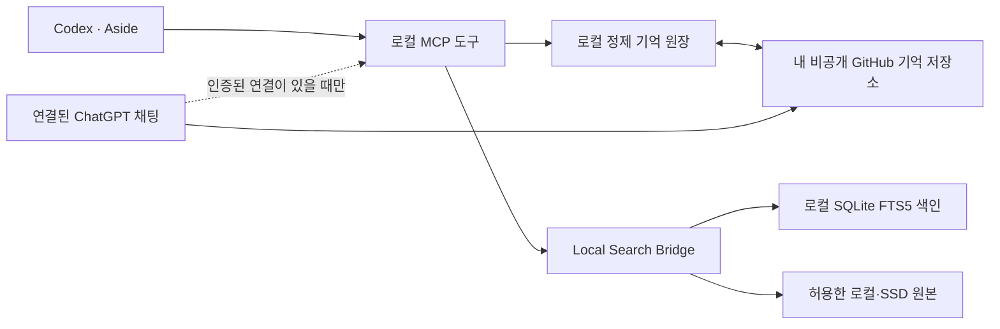

# AI Workspace Kit

**ChatGPT·Codex·Aside에서 작업 기억을 이어 쓰고, Mac의 로컬 파일을 읽고 수정하는 도구입니다.**

**파일 관리 MCP를 복사해서 받으셨나요? [한국어 설치·ChatGPT 연결 안내](START_HERE.md)부터 보세요.**
`--filesystem`으로 OS가 접근을 허용한 폴더·외장 SSD에 파일 생성·수정·이동·복구와 Word·Excel·PDF·이미지 처리를 수행합니다. 파일 엔진은 독립 배포판 [chatgpt-local-files](https://github.com/alice840126-ship-it/chatgpt-local-files)와 공유합니다. `--execution`을 추가하면 사용자 요청에 필요한 로컬 프로그램도 실행합니다. [공통 엔진 설치·범위](docs/SHARED_ENGINE.md)를 확인하세요.
계정·터널·개인 파일은 배포에 포함되지 않습니다. [전체 도구와 한계](docs/FILESYSTEM.md).

Codex로 코드를 만들고 결정을 내린 뒤 ChatGPT에서 아이디어를 더 이야기하거나, Codex를 연결한
Aside에서 같은 일을 이어갈 수 있습니다. 하지만 이 세 화면은 같은 프로젝트를 다뤄도 서로의 채팅을
자동으로 기억하지 않습니다. 새 채팅을 열 때마다 목표, 지난 결정, 현재 상태, 다음 작업을 다시 설명해야 합니다.

AI Workspace Kit은 세 화면이 참고할 수 있는 **공통 작업 기억**을 만듭니다. 확인된 결론과 진행 상태를
짧게 정리해 사용자 소유의 **비공개 GitHub 기억 저장소**에 두고, 연결된 도구가 필요할 때 찾아 읽습니다.
큰 원본 대화나 견적서·PDF까지 GitHub에 올리지 않습니다. 이 공개 저장소에는 도구의 코드와 예제만 있습니다.

[](docs/VALIDATION.md)
[](LICENSE)

[빠른 시작](#빠른-시작) · [클라이언트 연결](docs/CLIENTS.md) · [에이전트에 붙이는 규칙](docs/AGENT-GUIDANCE.md) · [검색 품질](docs/SEARCH-QUALITY.md) · [GitHub 동기화·운영](OPERATIONS.md) · [보안](SECURITY.md) · [English](docs/README.en.md)

> **v0.2 기술 미리보기.** macOS에서 검증했습니다. Linux용 CI 예제를 포함하며 실제 Linux 실행은 아직 미검증입니다. Windows 네이티브는 지원하지 않습니다.
> GitHub 연결만으로 모든 채팅이 자동 공유되지는 않습니다. 에이전트가 정제 요약을 기록해야 하며,
> ChatGPT에서 로컬 문서를 읽으려면 별도의 인증된 MCP 연결이 필요합니다. 음성 호출은 아직 검증하지 않았습니다.

## 왜 만들었나요?

프로젝트는 대화창 하나에서만 진행되지 않습니다. Codex에서 구현을 끝내고, ChatGPT에서 방향을 논의하고,
Aside에서 자료를 찾아 다음 수정을 할 수 있습니다. 이때 코드 파일은 GitHub에 있어도 다음 질문에 대한
답은 각각의 대화 속에 남기 쉽습니다.

- 이 프로젝트를 **왜** 시작했고, 어떤 요구를 해결하려 했나?
- 여러 방법 중 **무엇을 왜** 선택했나? 실패한 접근은 무엇인가?
- 지금 실제로 **어디까지** 끝났고, 무엇은 아직 검증하지 않았나?
- 다음에 무엇을 해야 하고, 관련 코드·문서는 **어디**에 있나?

매번 예전 대화 전문을 복사하는 방식은 찾기도 어렵고, 오래된 결론과 최신 상태가 섞이며,
토큰과 저장 공간도 낭비합니다. 그래서 원본 채팅은 원본대로 두고, 다시 일할 때 필요한 내용만
`CONTEXT / STATUS / DECISIONS / TODO / LINKS`로 압축해 **프로젝트의 현재 상태**를 만들었습니다.
GitHub를 정본으로 삼으면 한 기기나 한 앱의 대화 기록에만 묶이지 않고, 수정 이력과 복원 경로도 남습니다.

목표는 모든 채팅창에 똑같은 대화 전문을 복제하는 것이 아닙니다. **어느 화면에서 시작하든 같은 목표,
최근 결정, 진행 상태와 다음 일을 대략 공유해 다시 설명하는 시간을 줄이는 것**입니다.

## 세 화면에서 어떻게 이어지나요?

예를 들어 Codex에서 “고객 제안서 초안을 만들었고, 교육 범위는 다음에 확인하기로 했다”고 결정했다면:

1. Codex가 확인된 결론과 다음 할 일을 짧은 **checkpoint(작업 기록)**로 남깁니다. Kit은 중복 입력을 막고 주제별 현재 상태를 갱신합니다.
2. 비공개 GitHub 기억 저장소에 그 정제 기록을 게시합니다. 다른 기기는 이 기록을 받아 같은 주제의 맥락을 복원할 수 있습니다.
3. ChatGPT 채팅에서 “그 고객 제안서 어디까지 했지?”라고 하면, **연결된 비공개 GitHub 기억**을 읽어 지난 결론과 남은 일을 확인합니다.
4. Codex를 사용하는 Aside에서도 **같은 로컬 상태와 MCP(Model Context Protocol, AI 도구 연결 규약) 도구**를 연결하면 그 주제를 조회하고 작업을 이어갈 수 있습니다.
5. 이후 새로 확인한 결정은 **기록 입력 경로가 연결된 쪽에서** 다시 짧게 남깁니다. 읽기 전용 ChatGPT 연결만으로 ChatGPT 대화가 자동 저장되지는 않습니다.

여기서 말하는 **같은 사용 경험**은 세 앱의 화면을 똑같이 만드는 것이 아닙니다. 프로젝트 이름만 말해도
같은 현재 상태·결정 이유·다음 작업을 찾아 이어가고, 실제 문서에 관한 질문은 원본을 확인한 뒤
답하도록 하는 공통 작업 방식입니다. 앱마다 연결 방법과 도구 지원 범위는 다릅니다.

**Aside에서 Codex 모델을 선택했다는 사실만으로 기억이 연결되는 것은 아닙니다.** Aside에도 Kit의 도구를
등록해야 합니다. ChatGPT 역시 이 공개 코드 저장소를 보기만 해서는 개인 작업 기억을 알 수 없습니다.
사용자의 **비공개 기억 저장소**에 접근하도록 연결하고, 실제로 그 기록을 조회해야 합니다.
[클라이언트별 연결 방법과 확인 질문](docs/CLIENTS.md)에 이 차이를 설명했습니다.

### 실제 문서를 물으면 한 단계 더 필요합니다

“제안서 어디까지 했지?”는 정제 기억으로 답할 수 있지만, “견적서의 정확한 금액은?”은 원본 확인이
필요합니다. Kit은 허용한 로컬·외장 SSD 폴더에서 문서를 검색하고, 결과 ID로 해당 파일을 **다시 열어**
내용을 확인하는 도구를 제공합니다. GitHub는 *작업 맥락의 정본*, 로컬/SSD는 *큰 원본 자료의 정본*입니다.
다른 기기에서 GitHub 기억을 복원해도 그 기기에 없는 SSD의 PDF가 자동으로 복사되지는 않습니다.

### 두 가지 질문은 다르게 처리합니다

| 질문 | 읽는 곳 | 확인할 결과 |
|---|---|---|
| “지난번에 무엇을 결정했지?” | 최근 checkpoint와 GitHub 정제 기억 | 결정·이유·진행 상태·TODO와 기록 시각 |
| “견적서의 정확한 금액은?” | 허용한 로컬/SSD 폴더의 **실제 원본** | 검색 결과 ID로 파일을 재열람한 내용과 원본 경로 |

원본이 이동했거나 SSD가 연결되지 않으면 접근 실패를 반환합니다. 검색 결과의 짧은 미리보기만 보고
금액·조건을 추측하는 용도로 만들지 않았습니다.

## 어떻게 나누나요?



| 위치 | 저장하는 것 | 저장하지 않는 것 |
|---|---|---|
| 이 공개 저장소 | 코드, 합성 예제, 테스트, 안내 | 사용자 기억, 인증정보, 원본 세션 |
| 사용자의 비공개 GitHub | 정제 이벤트, Daily, Topic, 현재 상태 | 검색 DB, 원본 파일, API 키 |
| 사용자 컴퓨터 | SQLite 원장·색인, 허용 경로, 기기별 연결 | 자동 공개 자료 |

코드 저장소와 기억 저장소는 **별도**입니다. 원본 문서는 계속 사용자 로컬/SSD가 정본입니다.
다른 컴퓨터에서 기억은 받을 수 있지만, 그 컴퓨터에 없는 SSD 문서가 복제되는 것은 아닙니다.

## 할 수 있는 것

- 구조화된 요약 입력과 중복 방지
- 최근 Warm Memory → 반복·결정·TODO 신호에 따른 정제 기억 승격
- `Session → Daily → Topic → Candidate → Project → Archive` 표현
- GitHub의 정제 기록 수신·게시, 충돌 시 보존하고 중단
- Markdown, TXT, JSON/JSONL, PDF, DOCX의 로컬 본문 검색
- 원본 ID를 사용한 제한된 길이의 재읽기, 이동·변경·SSD 분리 상태 반환
- 모든 검색어 일치가 없을 때만 부분 일치 후보를 제시하고, 원본 재읽기를 필수로 유지
- 마지막 GitHub 게시 검증 시점과 로컬 정제 변경 상태 조회 (`ai-workspace status`)
- 읽기 전용 MCP(Model Context Protocol, AI 도구 연결 규약)
- 모델 호출 없는 정기 유지 작업

Candidate 승격은 저장소를 자동 생성하는 동작이 아닙니다. 이 공개판은 앱 코드·Skills의
양방향 백업, Telegram 봇, Hermes, Atlas, 클라우드 저장 서비스까지 설치하지 않습니다.
Codex 과거 세션 색인 코드는 고급 기능으로 포함하지만 기본 실행에서는 읽거나 수집하지 않습니다.

### 자동화의 경계

`tick`은 **이미 입력된** checkpoint를 승격·정리하고, 등록한 문서 폴더의 변경분을 살피며,
GitHub가 연결됐다면 정제 기억을 동기화합니다. 이 과정에서 요약용 LLM을 주기적으로 호출하지 않습니다.
반면 새 대화의 결론을 파악해 checkpoint를 작성하는 일은 Codex·Aside 등 현재 작업 중인 에이전트가
수행해야 합니다. 이 패키지만 설치해 두면 ChatGPT 대화가 자동 수집되는 것으로 이해하면 안 됩니다.
ChatGPT 음성에서 도구를 쓸 수 있는지도 계정과 기능 지원에 따라 실제 호출로 따로 검증해야 합니다.

## 빠른 시작

필수: Python 3.11 이상과 Git. PDF는 `pdftotext`(Poppler)가 있어야 합니다.
기본 데모에는 API 키·GitHub 로그인·유료 모델 호출이 필요 없습니다.

```bash
git clone https://github.com/alice840126-ship-it/ai-workspace-kit.git
cd ai-workspace-kit
python3 -m venv .venv
source .venv/bin/activate
python -m pip install -e .
ai-workspace doctor
python -m workspace.demo
```

`doctor`의 선택 도구 목록에서 `gh`·`gitleaks`가 없어도 로컬 데모는 됩니다.
GitHub 게시에는 둘 다 필요합니다. macOS에서는 `brew install gh gitleaks poppler`로 설치할 수 있습니다.

데모는 임시 폴더에서 가상 견적서로 다음을 검증한 뒤 해당 임시 자료만 정리합니다.

1. 같은 요약을 두 번 넣어도 한 건만 저장
2. 정제 기억 승격과 Markdown 생성
3. `ExampleCo 견적서` 검색과 원본 읽기
4. 합계 `2,200,000원`, VAT 포함, 사용자 교육 2회 확인
5. 원본이 사라지면 `source_unavailable` 반환

### 받아서 어디까지 재현할 수 있나요?

| 단계 | 다른 사람이 해야 할 일 | 확인할 수 있는 결과 |
|---|---|---|
| 로컬 데모 | 위 명령만 실행 | 기억 중복 방지·승격, 문서 검색·원본 재읽기. 계정·API 키 불필요 |
| 자신의 작업 기억 | `init` 후 확인된 checkpoint 입력 | 내 로컬 기억 조회. 원본 대화 자동 수집은 아님 |
| 여러 기기 공유 | [별도 비공개 GitHub 기억 저장소를 만들어 연결](OPERATIONS.md) | 정제 기억 게시·수신. 공개 코드 저장소에는 개인 기억이 없음 |
| Codex·Aside | 각 앱에 [로컬 MCP 도구 등록](docs/CLIENTS.md) | 같은 기기의 기억 조회와 허용 문서 검색. Aside의 Codex 모델 선택만으로는 연결되지 않음 |
| ChatGPT 채팅 | 자신의 비공개 기억 저장소를 GitHub 연결에 허용 | 게시된 정제 기억 조회. 로컬 문서 읽기는 별도 인증 연결 필요 |
| ChatGPT 음성 | 계정의 도구 지원 여부와 실제 호출 확인 | 이 배포판에서 아직 검증되지 않음 |

즉 **프로그램의 로컬 기능은 공개 코드만으로 재현**할 수 있지만, 세 앱의 공통 기억 경험은
사용자마다 자신의 비공개 저장소와 앱 연결을 설정한 뒤 실제 질문으로 확인해야 합니다.
다른 사람의 계정·SSD·개인 기억까지 이 저장소에서 복제할 수는 없습니다.

## 내 기억 만들기

기본 위치는 `~/ai-workspace-memory`(기억)와 `~/.local/share/ai-workspace-kit`(비공개 상태)입니다.
이미 사용 중인 폴더에는 덮어쓰지 않습니다. 위치를 바꾸려면 **모든 명령에 동일한**
`--memory /absolute/memory --state /absolute/state`를 명령 이름 앞에 전달하세요.

```bash
ai-workspace init
# 예제 날짜를 현재 시각으로 바꾸고 요약 입력
python -c 'import json; from datetime import datetime, timezone; p=json.load(open("examples/checkpoint.json")); p["stamp"]=datetime.now(timezone.utc).isoformat(); print(json.dumps(p))' | ai-workspace checkpoint
ai-workspace recall 'demokit'
```

현재 날짜를 쓰는 이유: Warm Memory는 최근 3일을 대상으로 승격합니다. 오래된 예제를 그대로 넣으면
접수는 되지만 최근 기억으로 승격되지 않습니다. 실제 작업에서는 예제 대신 확인한 결정·진행·TODO를 넣으세요.
같은 session/checkpoint ID의 내용을 수정하면 충돌합니다. 새 결정에는 새 checkpoint ID를 씁니다.

## 내 문서 연결하기

아래 경로는 자신의 실제 업무 폴더로 바꾸세요. 홈 전체, 시스템 폴더, 인증 폴더는 대상으로 삼지 마세요.
등록은 파일 위치와 기기 식별자를 로컬 상태에만 저장합니다.

```bash
ai-workspace allow-root /absolute/path/to/work-documents --label work-documents
ai-workspace-artifacts index --budget 10
ai-workspace-artifacts search 'ExampleCo 견적서'
ai-workspace-artifacts read RESULT_ID
```

검색 결과의 `id`를 `RESULT_ID`에 넣습니다. 다른 상태 폴더를 썼다면 artifacts와 MCP에도
같은 `--state`를 전달해야 합니다. PDF는 텍스트 추출이며 화면 표시·다운로드·OCR 도구가 아닙니다.
스캔 PDF는 별도 OCR이 필요합니다. 기본 파일 한도 32MiB, 추출 본문 한도 2MiB입니다.

## 다른 AI에서 이어가기

| 경로 | 필요한 연결 | 범위 |
|---|---|---|
| Codex | 로컬 CLI 또는 stdio MCP | 기억 읽기·정제 요약 입력·문서 검색 |
| Aside | 로컬 stdio MCP 등록 | 노출된 도구로 동일 원장 이용 |
| ChatGPT GitHub 연결 | 자신의 비공개 기억 저장소 권한 | GitHub에 게시된 정제 기억 |
| ChatGPT 로컬 문서 | 인증된 Secure MCP Tunnel + 개인 MCP 앱 | 실행 중인 컴퓨터의 허용 원본 읽기 |
| ChatGPT 음성 | 해당 계정의 도구 지원 + 별도 실호출 검증 | 이 배포판에서 미검증 |

[연결 안내](docs/CLIENTS.md)에 등록 명령, 제공 도구, 시험 질문, 실패 판단 기준이 있습니다.
GitHub connector의 반영 지연이나 앱의 도구 선택을 이 코드가 강제할 수는 없습니다.

## 비용과 자동화

`tick`은 요약 모델이나 임베딩 API를 호출하지 않습니다. 정제 요약은 진행 중인 에이전트가
만들므로 그 대화의 토큰은 사용합니다. GitHub·ChatGPT·터널의 계정 조건은 각 서비스 조건을 따릅니다.

기존 예약 실행기가 있다면 거기에 `ai-workspace tick`을 10~30분 간격으로 추가하면 됩니다.
이 설치는 예약 작업을 자동 생성하지 않습니다. GitHub에 연결한 경우에만 tick이 검증된 기억을 게시합니다.
[초기 GitHub 연결과 여러 기기 운영](OPERATIONS.md)을 먼저 확인하세요.

## 검증과 참여

```bash
python -m unittest discover -s tests -v
```

개인 운영본의 검색·읽기 엔진을 분리했으며, 공개판은 합성 자료로 검증합니다.
기존 운영본의 ChatGPT 텍스트 연결 경험이 모든 계정의 연결 성공을 보장하지는 않습니다.
현재 확인 범위는 [검증 기록](docs/VALIDATION.md)에 명시합니다.

도움이 됐다면 Star로 알려주세요. 설치가 막힌 지점, 사용한 OS·Python 버전, 비밀정보를 지운 오류 코드,
기대했던 흐름을 Issue에 남겨주시면 재현에 도움이 됩니다. 고객 문서나 로그 전체는 올리지 마세요.
기여 방법은 [CONTRIBUTING.md](CONTRIBUTING.md)를 참고하세요.

MIT License. OpenAI·GitHub·Aside의 공식 제품이 아닌 독립 프로젝트입니다.
