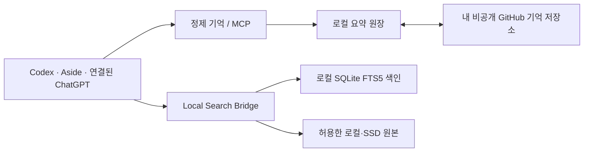

# AI Workspace Kit

**Codex에서 하던 일을 ChatGPT와 Aside에서도 이어가기 위한, 내 소유의 작업 기억 도구.**

AI와 함께 프로젝트를 진행하다 보면 코드는 GitHub에 남아도 “왜 이 방법을 택했는지”,
“어디까지 끝냈는지”, “다음에 무엇을 해야 하는지”는 대화창에 흩어집니다.
AI Workspace Kit은 확인된 결정·진행 상태·다음 할 일을 짧은 기록으로 받아 **내 비공개 GitHub 저장소**에
정리합니다. 견적서처럼 원본 확인이 필요한 자료는 허용한 로컬·외장 SSD 폴더에서 검색하고,
선택한 파일을 다시 열어 읽습니다. 공개되는 것은 이 도구의 코드이며, 내 업무 기억과 문서는 공개되지 않습니다.

[](docs/VALIDATION.md)
[](LICENSE)

[빠른 시작](#빠른-시작) · [클라이언트 연결](docs/CLIENTS.md) · [GitHub 동기화·운영](OPERATIONS.md) · [보안](SECURITY.md) · [English](docs/README.en.md)

> **v0.1 기술 미리보기.** macOS에서 검증했습니다. Linux용 CI 예제를 포함하며 실제 Linux 실행은 아직 미검증입니다. Windows 네이티브는 지원하지 않습니다.
> GitHub 연결만으로 모든 채팅이 자동 공유되지는 않습니다. 에이전트가 정제 요약을 기록해야 하며,
> ChatGPT에서 로컬 문서를 읽으려면 별도의 인증된 MCP 연결이 필요합니다. 음성 호출은 아직 검증하지 않았습니다.

## 사용하면 어떤 모습인가요?

예를 들어 Codex에서 고객 프로젝트를 진행하며 “제안서 초안 완료, 견적 금액은 원본 PDF에서 확인,
다음 작업은 교육 범위 검토”라고 결정했다고 가정해 보겠습니다.

1. 작업 중인 AI가 **대화 전문 대신** 확인된 결론·현재 상태·할 일을 짧은 checkpoint로 남깁니다.
2. Kit이 같은 기록의 중복 입력을 막고, 최근 기록을 주제별 `CONTEXT / STATUS / DECISIONS / TODO / LINKS`로 정리합니다.
3. 연결된 경우 그 정제 기억을 **사용자 소유의 비공개 GitHub 저장소**에 게시합니다.
4. 나중에 ChatGPT에서 “그 고객 프로젝트 어디까지 했지?”라고 물으면, 연결된 GitHub 기억을 읽어 맥락을 되찾을 수 있습니다.
5. “견적서의 금액과 교육 횟수는?”처럼 **문서의 실제 내용**을 묻는다면, 로컬 검색 도구가 켜진 기기에서 후보를 찾고 원본을 다시 읽어야 답할 수 있습니다.

따라서 GitHub는 *작업의 맥락을 공유하는 정본*, 로컬/SSD는 *큰 원본 자료의 정본*입니다.
다른 기기에서는 GitHub 기억을 복원할 수 있지만, 연결되지 않은 SSD의 PDF까지 생겨나지는 않습니다.
새 채팅이 알아서 이전 대화를 전부 아는 방식도 아닙니다. 기록을 남길 에이전트 지침과 각 클라이언트의
실제 연결이 필요합니다. [클라이언트별 연결 방법과 확인 질문](docs/CLIENTS.md)을 제공합니다.

### 두 가지 질문은 다르게 처리합니다

| 질문 | 읽는 곳 | 확인할 결과 |
|---|---|---|
| “지난번에 무엇을 결정했지?” | 최근 checkpoint와 GitHub 정제 기억 | 결정·이유·진행 상태·TODO와 기록 시각 |
| “견적서의 정확한 금액은?” | 허용한 로컬/SSD 폴더의 **실제 원본** | 검색 결과 ID로 파일을 재열람한 내용과 원본 경로 |

원본이 이동했거나 SSD가 연결되지 않으면 접근 실패를 반환합니다. 검색 결과의 짧은 미리보기만 보고
금액·조건을 추측하는 용도로 만들지 않았습니다.

## 이런 문제가 있었나요?

- Codex에서 정한 내용을 ChatGPT에 다시 설명한다.
- 며칠 뒤 이어서 하려니 결정 이유와 다음 작업이 사라졌다.
- GitHub에는 요약이 있는데, 실제 견적서나 제안서는 SSD에 있다.
- 대화 전체를 저장하거나 매번 요약 모델을 돌리기에는 부담스럽다.

이 도구는 모든 대화를 복제하지 않습니다. 의미 있는 완료·결정·TODO만 짧게 받아
`CONTEXT / STATUS / DECISIONS / TODO / LINKS`로 정리합니다.
문서 질문에는 기억만 보고 답하지 않고 **검색 → 원본 다시 읽기 → 근거 있는 답변**을 사용합니다.

## 어떻게 나누나요?



| 위치 | 저장하는 것 | 저장하지 않는 것 |
|---|---|---|
| 이 공개 저장소 | 코드, 합성 예제, 테스트, 안내 | 사용자 기억, 인증정보, 원본 세션 |
| 사용자의 비공개 GitHub | 정제 이벤트, Daily, Topic, 현재 상태 | 검색 DB, 원본 파일, API 키 |
| 사용자 컴퓨터 | SQLite 원장·색인, 허용 경로, 기기별 연결 | 자동 공개 자료 |

코드 저장소와 기억 저장소는 **별도**입니다. 원본 문서는 계속 사용자 로컬/SSD가 정본입니다.
다른 컴퓨터에서 기억은 받을 수 있지만, 그 컴퓨터에 없는 SSD 문서가 복제되는 것은 아닙니다.

## 할 수 있는 것

- 구조화된 요약 입력과 중복 방지
- 최근 Warm Memory → 반복·결정·TODO 신호에 따른 정제 기억 승격
- `Session → Daily → Topic → Candidate → Project → Archive` 표현
- GitHub의 정제 기록 수신·게시, 충돌 시 보존하고 중단
- Markdown, TXT, JSON/JSONL, PDF, DOCX의 로컬 본문 검색
- 원본 ID를 사용한 제한된 길이의 재읽기, 이동·변경·SSD 분리 상태 반환
- 읽기 전용 MCP(Model Context Protocol, AI 도구 연결 규약)
- 모델 호출 없는 정기 유지 작업

Candidate 승격은 저장소를 자동 생성하는 동작이 아닙니다. 이 공개판은 앱 코드·Skills의
양방향 백업, Telegram 봇, Hermes, Atlas, 클라우드 저장 서비스까지 설치하지 않습니다.
Codex 과거 세션 색인 코드는 고급 기능으로 포함하지만 기본 실행에서는 읽거나 수집하지 않습니다.

### 자동화의 경계

`tick`은 **이미 입력된** checkpoint를 승격·정리하고, 등록한 문서 폴더의 변경분을 살피며,
GitHub가 연결됐다면 정제 기억을 동기화합니다. 이 과정에서 요약용 LLM을 주기적으로 호출하지 않습니다.
반면 새 대화의 결론을 파악해 checkpoint를 작성하는 일은 Codex·Aside 등 현재 작업 중인 에이전트가
수행해야 합니다. 이 패키지만 설치해 두면 ChatGPT 대화가 자동 수집되는 것으로 이해하면 안 됩니다.
ChatGPT 음성에서 도구를 쓸 수 있는지도 계정과 기능 지원에 따라 실제 호출로 따로 검증해야 합니다.

## 빠른 시작

필수: Python 3.11 이상과 Git. PDF는 `pdftotext`(Poppler)가 있어야 합니다.
기본 데모에는 API 키·GitHub 로그인·유료 모델 호출이 필요 없습니다.

```bash
git clone https://github.com/alice840126-ship-it/ai-workspace-kit.git
cd ai-workspace-kit
python3 -m venv .venv
source .venv/bin/activate
python -m pip install -e .
ai-workspace doctor
python -m workspace.demo
```

`doctor`의 선택 도구 목록에서 `gh`·`gitleaks`가 없어도 로컬 데모는 됩니다.
GitHub 게시에는 둘 다 필요합니다. macOS에서는 `brew install gh gitleaks poppler`로 설치할 수 있습니다.

데모는 임시 폴더에서 가상 견적서로 다음을 검증한 뒤 해당 임시 자료만 정리합니다.

1. 같은 요약을 두 번 넣어도 한 건만 저장
2. 정제 기억 승격과 Markdown 생성
3. `ExampleCo 견적서` 검색과 원본 읽기
4. 합계 `2,200,000원`, VAT 포함, 사용자 교육 2회 확인
5. 원본이 사라지면 `source_unavailable` 반환

## 내 기억 만들기

기본 위치는 `~/ai-workspace-memory`(기억)와 `~/.local/share/ai-workspace-kit`(비공개 상태)입니다.
이미 사용 중인 폴더에는 덮어쓰지 않습니다. 위치를 바꾸려면 **모든 명령에 동일한**
`--memory /absolute/memory --state /absolute/state`를 명령 이름 앞에 전달하세요.

```bash
ai-workspace init
# 예제 날짜를 현재 시각으로 바꾸고 요약 입력
python -c 'import json; from datetime import datetime, timezone; p=json.load(open("examples/checkpoint.json")); p["stamp"]=datetime.now(timezone.utc).isoformat(); print(json.dumps(p))' | ai-workspace checkpoint
ai-workspace recall 'demokit'
```

현재 날짜를 쓰는 이유: Warm Memory는 최근 3일을 대상으로 승격합니다. 오래된 예제를 그대로 넣으면
접수는 되지만 최근 기억으로 승격되지 않습니다. 실제 작업에서는 예제 대신 확인한 결정·진행·TODO를 넣으세요.
같은 session/checkpoint ID의 내용을 수정하면 충돌합니다. 새 결정에는 새 checkpoint ID를 씁니다.

## 내 문서 연결하기

아래 경로는 자신의 실제 업무 폴더로 바꾸세요. 홈 전체, 시스템 폴더, 인증 폴더는 대상으로 삼지 마세요.
등록은 파일 위치와 기기 식별자를 로컬 상태에만 저장합니다.

```bash
ai-workspace allow-root /absolute/path/to/work-documents --label work-documents
ai-workspace-artifacts index --budget 10
ai-workspace-artifacts search 'ExampleCo 견적서'
ai-workspace-artifacts read RESULT_ID
```

검색 결과의 `id`를 `RESULT_ID`에 넣습니다. 다른 상태 폴더를 썼다면 artifacts와 MCP에도
같은 `--state`를 전달해야 합니다. PDF는 텍스트 추출이며 화면 표시·다운로드·OCR 도구가 아닙니다.
스캔 PDF는 별도 OCR이 필요합니다. 기본 파일 한도 32MiB, 추출 본문 한도 2MiB입니다.

## 다른 AI에서 이어가기

| 경로 | 필요한 연결 | 범위 |
|---|---|---|
| Codex | 로컬 CLI 또는 stdio MCP | 기억 읽기·정제 요약 입력·문서 검색 |
| Aside | 로컬 stdio MCP 등록 | 노출된 도구로 동일 원장 이용 |
| ChatGPT GitHub 연결 | 자신의 비공개 기억 저장소 권한 | GitHub에 게시된 정제 기억 |
| ChatGPT 로컬 문서 | 인증된 Secure MCP Tunnel + 개인 MCP 앱 | 실행 중인 컴퓨터의 허용 원본 읽기 |
| ChatGPT 음성 | 해당 계정의 도구 지원 + 별도 실호출 검증 | 이 배포판에서 미검증 |

[연결 안내](docs/CLIENTS.md)에 등록 명령, 제공 도구, 시험 질문, 실패 판단 기준이 있습니다.
GitHub connector의 반영 지연이나 앱의 도구 선택을 이 코드가 강제할 수는 없습니다.

## 비용과 자동화

`tick`은 요약 모델이나 임베딩 API를 호출하지 않습니다. 정제 요약은 진행 중인 에이전트가
만들므로 그 대화의 토큰은 사용합니다. GitHub·ChatGPT·터널의 계정 조건은 각 서비스 조건을 따릅니다.

기존 예약 실행기가 있다면 거기에 `ai-workspace tick`을 10~30분 간격으로 추가하면 됩니다.
이 설치는 예약 작업을 자동 생성하지 않습니다. GitHub에 연결한 경우에만 tick이 검증된 기억을 게시합니다.
[초기 GitHub 연결과 여러 기기 운영](OPERATIONS.md)을 먼저 확인하세요.

## 검증과 참여

```bash
python -m unittest discover -s tests -v
```

개인 운영본의 검색·읽기 엔진을 분리했으며, 공개판은 합성 자료로 검증합니다.
기존 운영본의 ChatGPT 텍스트 연결 경험이 모든 계정의 연결 성공을 보장하지는 않습니다.
현재 확인 범위는 [검증 기록](docs/VALIDATION.md)에 명시합니다.

도움이 됐다면 Star로 알려주세요. 설치가 막힌 지점, 사용한 OS·Python 버전, 비밀정보를 지운 오류 코드,
기대했던 흐름을 Issue에 남겨주시면 재현에 도움이 됩니다. 고객 문서나 로그 전체는 올리지 마세요.
기여 방법은 [CONTRIBUTING.md](CONTRIBUTING.md)를 참고하세요.

MIT License. OpenAI·GitHub·Aside의 공식 제품이 아닌 독립 프로젝트입니다.
